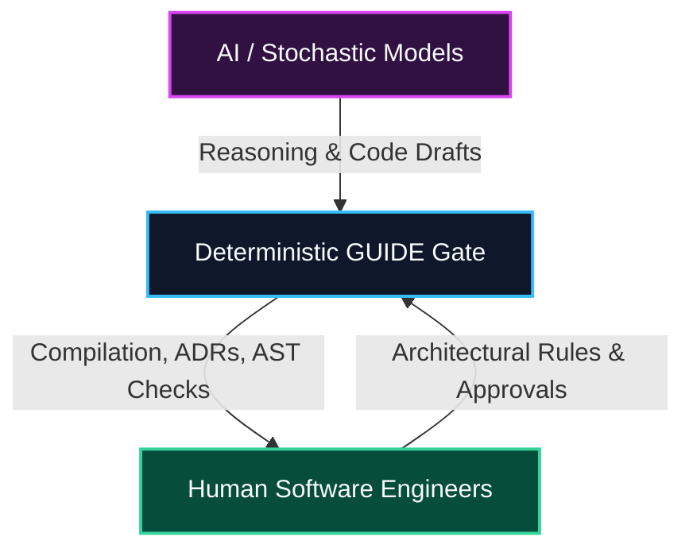

# GUIDE

> "Engineering should evolve with AI—not around it."

GUIDE is an open engineering initiative exploring how software engineering should evolve by deliberately allocating responsibilities between engineers, deterministic systems, and AI.

Rather than focusing on better prompts or larger context windows, GUIDE explores a different question:

> Which engineering responsibilities belong to AI, which belong to deterministic systems, and which should always remain with engineers?

This repository contains both the proposal and a working reference implementation used to explore these ideas.

---

## The Problem

Modern AI coding assistants generate software remarkably well.

As projects become larger, however, engineers spend increasing effort:
- Reconstructing project knowledge
- Re-explaining architecture
- Rebuilding context
- Reviewing unnecessarily complex code
- Enforcing engineering rules manually

GUIDE explores whether these responsibilities should become part of the engineering process itself rather than being repeatedly delegated to a language model.

---

## The Proposal

GUIDE proposes a simple engineering model.

Language Models should reason.

Engineering Platforms should engineer.

Whenever an engineering responsibility can be solved deterministically, it should preferably be solved deterministically.

Engineering knowledge should become a project asset rather than conversational context.

AI should participate in software engineering under structured guardrails.

### Allocation of Responsibilities

---

## GUIDE Principles

The initiative is built around five core principles. For a complete discussion and analysis, read the [GUIDE Proposal](docs/philosophy/GUIDE-Proposal.md):

* **Guided Development**
* **Understandable Software**
* **Institutionalized Knowledge**
* **Deterministic Engineering**
* **Engineering Responsibility**

---

## Repository Structure

- [src/](src): Reference implementation codebase (C# / .NET)
  - [src/Guide.Cli/](src/Guide.Cli): Command Line Interface
  - [src/Guide.Core/](src/Guide.Core): Contracts, entities, and Finite State Machine definitions
  - [src/Guide.Semantic/](src/Guide.Semantic): Roslyn-based AST parsing and semantic graphs
  - [src/Guide.Knowledge/](src/Guide.Knowledge): SQLite knowledge store and ADR mappings
  - [src/Guide.Memory/](src/Guide.Memory): SQLite cache for recording and matching healing patterns
  - [src/Guide.Validation/](src/Guide.Validation): MSBuild, NetArchTest execution, and WorkflowEngine orchestrator
- [docs/](docs): Core project documentation
  - [docs/philosophy/GUIDE-Proposal.md](docs/philosophy/GUIDE-Proposal.md): Foundational philosophy, workflow diagrams, and bibliography
  - [docs/implementation/GUIDE-Reference-Implementation.md](docs/implementation/GUIDE-Reference-Implementation.md): Technical architecture and CLI command guide
  - [docs/benchmarks/GUIDE-Benchmarks-Evaluation.md](docs/benchmarks/GUIDE-Benchmarks-Evaluation.md): Simulated multi-agent execution and token efficiency results
- [tests/](tests): Verification and testing suite
  - [tests/qa_verification_suite.ps1](tests/qa_verification_suite.ps1): End-to-end integration tests
- [WHY.md](WHY.md): The developer story and motivation

---

## Current Status

- **Draft 0.1:** Core principles defined.
- **Reference Implementation (Experimental):** Fully functional C# CLI and validation gate.
- **Benchmark Framework:** Working token measurement and pruning engine simulations.
- **Documentation:** Structured Trilogy (Proposal, Reference Implementation, Benchmarks).

---

## What GUIDE is not

GUIDE is not:
- Another LLM
- Another IDE
- Another AI coding assistant
- A replacement for Cursor, Claude Code, or Copilot
- A universal solution

GUIDE is an engineering proposal exploring how AI-assisted software development could evolve.

---

## Challenge GUIDE

GUIDE is intentionally published as a proposal rather than a conclusion.

If you disagree with an idea:
* Open an issue.

If you build a better implementation:
* Share it.

If you reproduce the benchmarks:
* Publish the results.

If you believe a principle is incorrect:
* Challenge it.

Engineering progresses through evidence and discussion.

---

## Roadmap

- [x] **Proposal** (Draft 0.1)
- [x] **MVP** (Reference implementation in C#)
- [x] **Benchmarks** (Simulated Gemini run results showing 91.1% input / 83.1% output reductions)
- [ ] **More Languages** (Port indexer and parser hooks to Python/JS)
- [ ] **More Benchmarks** (Evaluate performance across other LLM architectures)
- [ ] **Team Knowledge** (Collaborative remote store sync)
- [ ] **Community Feedback** (Refine principles based on developer experiences)

---

## References

- **Simon Willison:** Writings on Context Engineering and AI-assisted development ([simonwillison.net](https://simonwillison.net/)).
- **Model Context Protocol (MCP):** Open protocol for connecting models to local data sources ([modelcontextprotocol.io](https://modelcontextprotocol.io/)).
- **Extreme Programming (XP):** Agile software development methodology emphasizing fast feedback loops ([Extreme Programming Explained - Kent Beck]).
- **Agile Manifesto:** Foundational principles for software engineering collaboration ([agilemanifesto.org](https://agilemanifesto.org/)).
