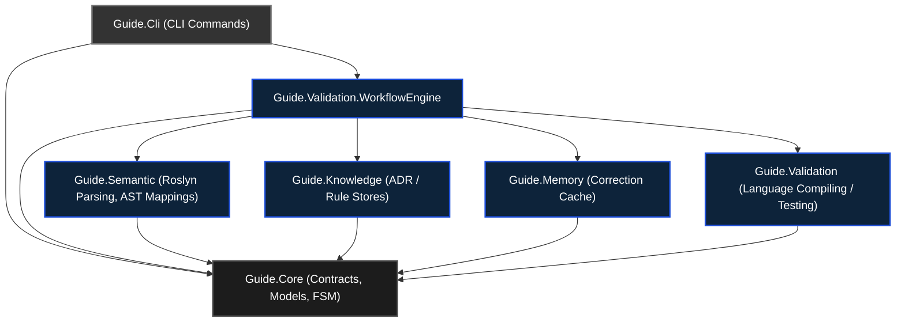

# GUIDE Platform Component Architecture

This document describes the architectural layout, component boundaries, orchestration flows, and G-U-I-D-E principles alignment of the GUIDE platform.

---

## 1. Subsystem Component Diagram

The following Mermaid diagram shows the component dependencies and architectural boundaries across the GUIDE platform.

---

## 2. WorkflowEngine Execution Flow

The `WorkflowEngine` acts as the central orchestrator for the task development and verification lifecycle. When running validation or auto-healing, it coordinates each phase explicitly:

```mermaid
sequenceDiagram
    autonumber
    participant CLI as Guide.Cli
    participant WE as WorkflowEngine
    participant SP as ISemanticParser
    participant KS as IKnowledgeStore
    participant LV as ILanguageValidator
    participant MEM as IEngineeringMemory
    participant AH as AutoHealer

    CLI->>WE: RunWorkflowAsync(description, filePath)
    
    %% Context Acquisition
    rect rgb(30, 41, 59)
        note right of WE: Context Acquisition
        WE->>SP: GetContextAsync(filePath)
        SP-->>WE: CodeContext (Imports, Classes, Signatures)
    end

    %% Database Store Query
    rect rgb(30, 41, 59)
        note right of WE: Query Knowledge & ADRs
        WE->>KS: GetLatestGraphVersionAsync()
        WE->>KS: GetSnapshotAsync(version)
        KS-->>WE: ExtractedKnowledge
        note over WE: Filter governing ADRs by AppliesTo
    end

    %% Deterministic Compilation / Verification
    rect rgb(30, 41, 59)
        note right of WE: Deterministic Validation
        WE->>LV: ValidateAsync(solutionPath, runTests: false)
        LV-->>WE: ValidationResult (IsSuccess, Errors)
    end

    alt Validation Succeeded
        WE-->>CLI: WorkflowResult (IsSuccess: true)
    else Validation Failed
        %% Memory Lookup & Auto Healing
        rect rgb(64, 20, 20)
            note right of WE: Memory Lookup & Repair Loop
            WE->>MEM: FindSimilarCorrectionsAsync(errorCode, errorLog)
            MEM-->>WE: MemoryMatches (SimilarityScore, PatchedSnippet)
            WE->>AH: HealAsync(solutionPath, repoRoot, filePath, errors)
            AH-->>WE: HealingResult (IsSuccess, Iterations, Errors)
        end
        
        alt Healing Succeeded
            WE->>MEM: RecordCorrectionAsync(errorCode, errorLog, original, patched, isSuccess: true)
            WE-->>CLI: WorkflowResult (IsSuccess: true, HealingIterations)
        else Healing Failed
            WE-->>CLI: WorkflowResult (IsSuccess: false, Errors)
        end
    end
```

---

## 3. Mapping Subsystems to GUIDE Principles

The subsystems in this codebase align directly with the core **G-U-I-D-E** manifesto principles:

### `G` — Guided Development
* **Subsystem:** `Guide.Cli` & `WorkflowEngine`
* **Realization:** Development is directed through structured CLI stages (`init`, `index`, `validate`, `query-context`, `search`, `why`) and coordinates the task lifecycle using FSM transitions, ensuring consistency.

### `U` — Understandable Software
* **Subsystem:** `Guide.Core`
* **Realization:** Provides strict structural contracts and a Finite State Machine (`FeatureStateMachine`) defining explicit developer state progression.

### `I` — Institutionalized Knowledge
* **Subsystem:** `Guide.Semantic`, `Guide.Knowledge`, & `Guide.Memory`
* **Realization:** Mapped rules (`ADR`), project dependencies, and past structural corrections are version-controlled and preserved in local SQLite stores.

### `D` — Deterministic Engineering
* **Subsystem:** `Guide.Validation`
* **Realization:** Leverages local static compilers, parallel formatting engines, and architectural tests (`NetArchTest`) to identify problems deterministically, acting as a fast fail gate.

### `E` — Engineering Responsibility
* **Subsystem:** `Guide.Cli` (Git hooks)
* **Realization:** Hooks validation checks into `pre-push` git events, establishing human-centric control gates prior to code commits.
