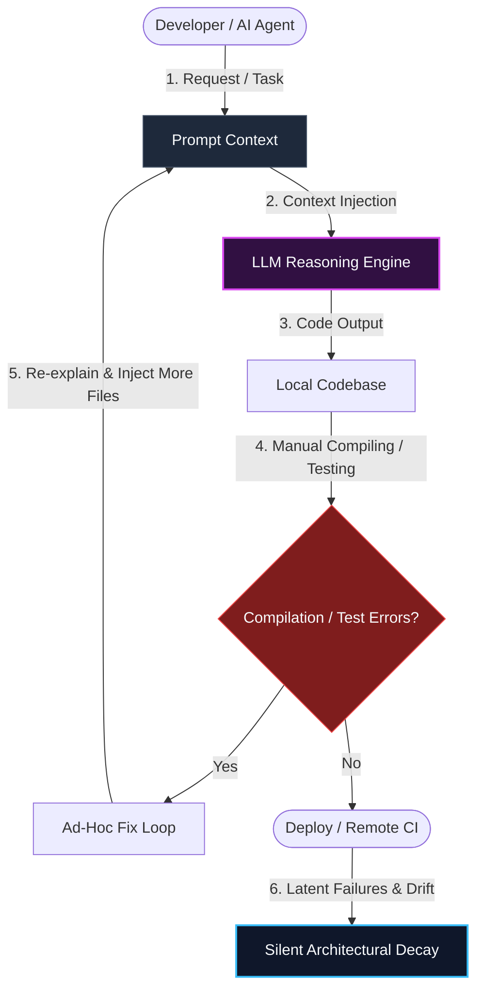
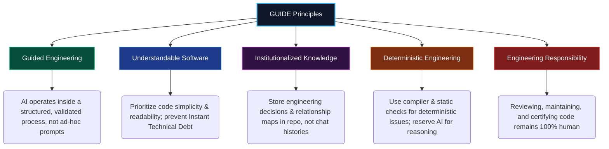
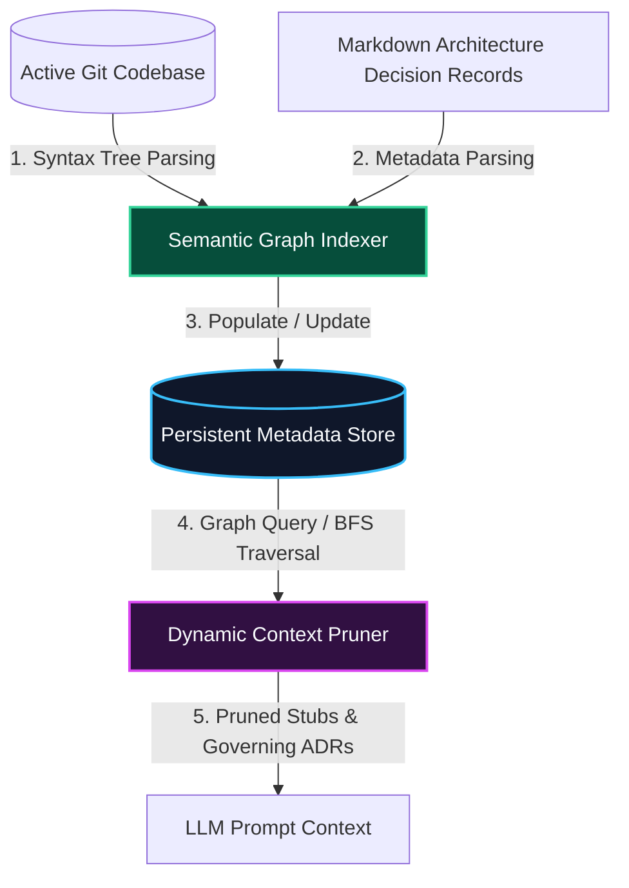
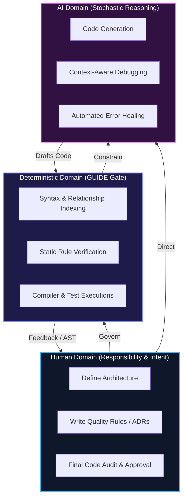
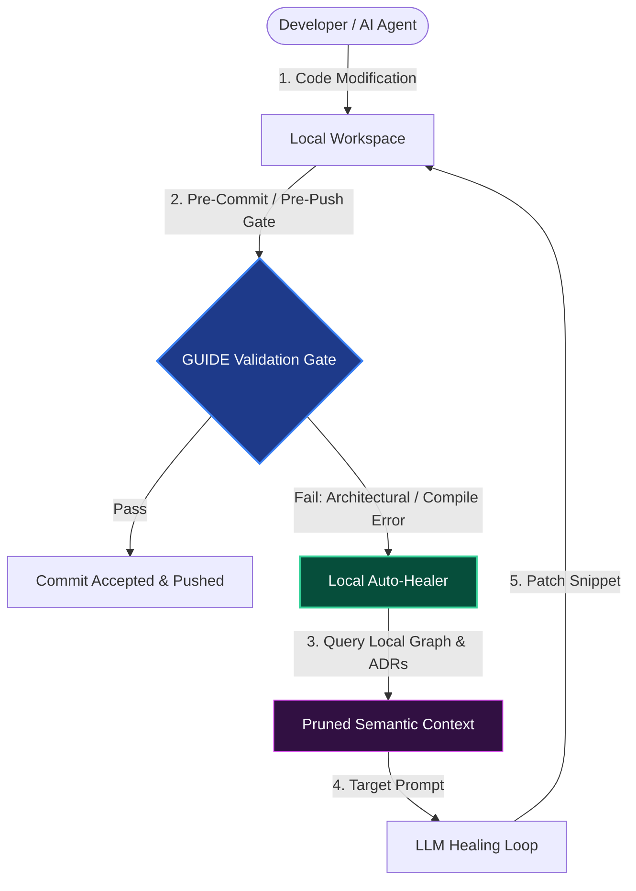

# GUIDE: A Proposal for Engineering Principles in AI-Assisted Software Development
## Draft 0.1

> "Engineering should evolve with AI—not around it."

---

## Table of Contents

1. [Before You Read](#before-you-read)
2. [Why This Proposal Exists](#why-this-proposal-exists)
3. [The Real Problem](#the-real-problem)
4. [The GUIDE Engineering Model](#the-guide-engineering-model)
5. [From Engineering Model to Engineering Principles](#from-engineering-model-to-engineering-principles)
6. [The GUIDE Principles](#the-guide-principles)
   - [G — Guided Engineering](#g--guided-engineering)
   - [U — Understandable Software](#u--understandable-software)
   - [I — Institutionalized Knowledge](#i--institutionalized-knowledge)
   - [D — Deterministic Engineering](#d--deterministic-engineering)
   - [E — Engineer Responsibility](#e--engineering-responsibility)
7. [From Principles to Practice](#from-principles-to-practice)
8. [The GUIDE Reference Architecture](#the-guide-reference-architecture)
9. [From Proposal to Implementation](#from-proposal-to-implementation)
10. [References](#references)

---

## Before You Read

Artificial Intelligence has changed software development faster than perhaps any other technology in recent decades. Code can now be generated in seconds. Entire features can be prototyped in minutes. Tasks that once required hours of implementation have become almost instantaneous.

As these tools have become part of everyday development, the software engineering community has naturally begun asking new questions:
* How should we collaborate with AI?
* How do we preserve project knowledge?
* How should engineering knowledge be represented?
* What belongs in prompts, and what belongs in the engineering process?
* How should AI-generated code be reviewed?
* How do we maintain software that is becoming increasingly inexpensive to generate?

These conversations are already taking place. Some focus on Context Engineering [5]. Others explore Model Context Protocol (MCP) [6], Retrieval-Augmented Generation (RAG) [8], dependency mapping, AI-native development environments, project memory, and autonomous software engineering. Each contributes valuable ideas and each addresses an important part of the problem.

This proposal is not an attempt to replace those conversations or claim ownership of them. It is an attempt to step back and look at them together.

Over time, I found myself repeatedly encountering the same engineering problems while building software with AI. As I experimented with different solutions, I gradually realized that many of the ideas being discussed across the industry seemed connected by a common theme.

Rather than asking how AI should become better at software engineering, I found myself asking a different question:

> **How should software engineering evolve now that AI has become another participant in the development process?**

This document is my attempt to explore that question. It does not claim to provide definitive answers. It does not claim that the ideas presented here are entirely new. Instead, it proposes one possible engineering perspective, supported by a working reference implementation, early benchmarks, and an invitation for others to challenge, improve, and extend these ideas.

> [!NOTE]
> GUIDE should therefore be read as an engineering proposal rather than a finished methodology. Like the software it discusses, I expect it to evolve.

*Transition: Understanding how AI interacts with development begins not with theory, but with the practical frustrations of daily workflows. In the next section, we explore the personal journey that led from rapid autocomplete to structural process design.*

---

## Why This Proposal Exists

Like many developers, I started using AI because it could write software faster than I could. Initially, the experience was remarkable. Repetitive work became easier. Learning unfamiliar technologies became faster. Experimenting with new ideas became almost effortless. For a while, it felt as though software development itself had fundamentally changed.

Then the projects became larger.

The language model rarely struggled to write code. It struggled to understand the project. Architectural decisions had to be explained repeatedly. The same files were explored over and over again. Project conventions slowly drifted. Features worked, tests passed, and yet reviewing the generated code often became more difficult than writing the feature myself.

On several occasions, the generated code had become so unnecessarily complex that I found myself asking the language model to explain the code it had just written before I could confidently review it. That was the moment something no longer felt right.

> "At first, I assumed the problem was my prompting. So I rewrote my prompts. Did it solve the problem? No."

Then I added markdown documentation, coding standards, architectural guidelines, project rules, dedicated review agents, semantic documentation, plugins, and increasingly structured workflows. Every improvement solved part of the problem. None solved the engineering process itself.

Without realizing it, I had gradually stopped improving prompts. **I was gradually building an engineering process around AI.**

That realization changed the question entirely. Instead of asking: *"How can I make the language model generate better code?"*, I started asking:

> **"Which responsibilities should belong to the language model, and which should belong to software engineering?"**

That distinction became the foundation of GUIDE. This proposal is not an attempt to build a better language model. Nor is it an attempt to replace existing AI development tools. It is an attempt to rethink how software engineering itself should evolve now that AI has become another participant in the development process.

### The Current Workflow

Below is the traditional loop where developers feed raw context into a Large Language Model and repeatedly prompt it to repair code without structured gatekeeping.

*Transition: Recognizing that prompts cannot replace software engineering processes exposes a deeper, structural flaw in how AI is currently deployed. Let us define this core challenge in the next section.*

---

## The Real Problem

Modern Large Language Models are remarkably capable of reasoning, generating code, explaining concepts, and accelerating software development. The problem is not that they are unintelligent. The problem is that we often expect them to perform responsibilities that belong elsewhere.

Large Language Models are probabilistic systems. They reason from the information they receive.
* They do not permanently understand projects.
* They do not remember architectural decisions.
* They do not know which engineering standards matter unless we provide them.

Every interaction begins with a reconstruction of understanding. As projects grow, reconstruction becomes increasingly expensive. Developers respond by writing larger prompts, creating documentation, introducing project rules, building knowledge bases, and experimenting with retrieval systems. These are all valuable improvements, but they also reveal something important.

We are no longer simply improving prompts. Instead, we are gradually building an engineering process around AI. That distinction matters.

The discussion surrounding AI-assisted development often focuses on questions such as:
* How can we provide better context?
* How can we improve retrieval?
* How can we increase context windows?
* How can we improve prompting?

These are worthwhile questions. However, I believe they all point toward a broader engineering question.

> **Which responsibilities should remain probabilistic, and which should become deterministic engineering systems?**

That question fundamentally changes how we think about AI-assisted development.
* Instead of asking the language model to repeatedly understand the project, perhaps the project itself should continuously understand itself.
* Instead of relying on AI to enforce architecture, perhaps architecture should become executable.
* Instead of reconstructing project knowledge during every conversation, perhaps engineering knowledge should become a persistent project asset.
* Instead of treating context as something assembled for each prompt, perhaps context should become the output of an engineering process.

Viewed individually, none of these ideas are entirely new. The industry is already exploring dependency mapping, Context Engineering, Retrieval-Augmented Generation, persistent memory, Model Context Protocol, and autonomous development environments. GUIDE does not attempt to replace these approaches. It proposes looking at them through a different lens.

Rather than asking how each individual technique improves AI, GUIDE asks a broader question: **How should software engineering itself evolve because these techniques now exist?**

*Transition: To answer this structural challenge, we need a different operational paradigm. In the next section, we present the GUIDE Engineering Model for dividing software responsibilities.*

---

## The GUIDE Engineering Model

The observations presented in the previous chapters gradually led me to a different way of thinking about AI-assisted software development. Rather than asking how to make the language model understand software engineering, I began asking how software engineering could better support the language model. That distinction became the foundation of GUIDE.

The central idea behind this proposal is simple:

> **A Large Language Model should reason, an engineering platform should engineer.**

Whenever an engineering responsibility can be performed deterministically, it should not rely exclusively on probabilistic reasoning. Likewise, whenever a problem genuinely requires reasoning, creativity, or interpretation, the language model remains the appropriate tool.

GUIDE therefore proposes separating responsibilities rather than concentrating them inside the language model.
* Instead of expecting every conversation to reconstruct project knowledge, the engineering process should continuously maintain that knowledge.
* Instead of asking the language model to remember architectural decisions, those decisions should become part of the project itself.
* Instead of relying on AI to enforce engineering rules, those rules should become executable whenever practical.
* Instead of manually assembling context for every request, context should become the output of an engineering process rather than the input to one.

This does not reduce the importance of the language model. On the contrary. It allows the language model to focus on the work it performs best:
* Reasoning.
* Problem solving.
* Design exploration.
* Code generation.

Engineering, however, extends beyond reasoning alone. It includes maintaining knowledge, protecting architecture, validating software, preserving consistency, capturing decisions, and reducing unnecessary complexity. These responsibilities do not disappear simply because AI can now generate software. If anything, they become increasingly important as the cost of generating software approaches zero.

> [!NOTE]
> Viewed from this perspective, AI is not replacing software engineering. It is becoming another participant within it. The objective of GUIDE is therefore not to build a better AI assistant; it is to build a better engineering process around AI.

*Transition: Shifting from an abstract engineering model to practical workflows requires a set of guiding observations. In the next section, we establish the principles of the GUIDE philosophy.*

---

## From Engineering Model to Engineering Principles

The engineering model proposed by GUIDE is intentionally independent of any particular technology, programming language, or AI model. It does not prescribe specific tools, development environments, or workflows. Instead, it proposes a different way of thinking about the responsibilities involved in AI-assisted software development.

Once those responsibilities are viewed differently, certain engineering principles begin to emerge naturally:
* If project understanding should persist beyond individual conversations, then engineering knowledge must become part of the project rather than part of the prompt.
* If deterministic engineering tasks can be automated reliably, then software engineering should avoid relying on probabilistic reasoning to perform them repeatedly.
* If AI can generate software faster than ever before, then readability and maintainability become even more important, not less.
* If language models are probabilistic systems, then mistakes should be expected and engineering processes should be designed to detect, validate, and recover from them rather than assuming perfect outputs.

These observations did not originate as abstract principles. They emerged while attempting to build a practical implementation of the engineering model described in the previous chapter.

The principles presented in the following sections should therefore be understood as observations rather than rules. They are not intended to define the only correct way of building AI-assisted software. They represent a set of engineering ideas that proved useful during the development of the reference implementation and that I believe deserve further discussion, experimentation, and validation.

*Transition: Let us explore these principles individually, detailing the observations and arguments behind Guided, Understandable, Institutionalized, Deterministic, and Engineer-led development.*

---

## The GUIDE Principles

The following principles represent the engineering philosophy that emerged while developing the GUIDE reference implementation. Each principle attempts to answer a different question about the relationship between software engineering and artificial intelligence.

### G - Guided Engineering

#### Observation
Large Language Models are exceptionally capable at reasoning, but they cannot infer engineering intent that has never been expressed.

Every project contains decisions that extend far beyond its source code. Architectural patterns, domain terminology, coding conventions, business rules, trade-offs, historical decisions, and organizational knowledge all influence how software should evolve. When this information is absent, the language model does not fail because it lacks intelligence; it fails because it lacks engineering context.

Developers often respond by writing larger prompts, creating project documentation, or repeatedly explaining the same concepts across different conversations. While these approaches improve the quality of the generated output, they also reveal an underlying problem: the engineering process is spending increasing effort reconstructing information that the project already possesses.

#### Proposal
Engineering should guide AI rather than expecting AI to independently discover engineering intent. Whenever possible, project knowledge should exist independently of individual prompts or conversations. Context should become the result of an engineering process rather than something manually assembled each time a task is performed.

#### Discussion
Guidance does not imply rigid control. Different projects require different levels of flexibility, and no engineering process can anticipate every situation. The purpose of guidance is simply to reduce unnecessary uncertainty. If the engineering process already knows the architecture, project conventions, and relevant domain knowledge, the language model should not be expected to rediscover them repeatedly.

#### Takeaway
> **Software engineering should actively provide the language model with the information it needs to reason effectively, rather than expecting that understanding to emerge independently during every interaction.**

---

### U - Understandable Software

#### Observation
Artificial Intelligence has dramatically reduced the cost of producing software. Today, hundreds or even thousands of lines of working code can be generated in minutes. This is one of the greatest strengths of AI-assisted development. It is also one of its greatest risks.

While software has become significantly cheaper to produce, it has not become easier to understand. Every generated abstraction, every unnecessary layer of complexity, and every implementation that requires additional effort to comprehend still carries the same maintenance cost it always has. In some cases, that cost may even increase. Unlike the effort required to generate software, the effort required to understand, review, debug, and evolve software remains fundamentally human.

#### Proposal
Understandability should be treated as an engineering requirement rather than a matter of personal preference. This proposal does not advocate a specific programming style, formatting convention, or coding standard.

Software should minimize the cognitive effort required to understand its behavior. Readability should not be sacrificed simply because AI makes it inexpensive to generate more compact, more abstract, or more sophisticated implementations. The question should never be: *"Can the AI generate this?"*; the question should be:

> **"Can another engineer confidently understand and maintain this?"**

#### Discussion
Production software is rarely maintained under ideal circumstances. Engineers investigate incidents under time pressure. They inherit unfamiliar codebases. They review changes made by other developers. They return to software they wrote months or years earlier.

Imagine being called to investigate a production issue at four o'clock in the morning. You are tired. You have never worked on this part of the system. The last thing you should have to do is spend valuable time deciphering complexity that adds no engineering value. Every unnecessary cognitive burden becomes engineering debt.

As AI continues to reduce the effort required to generate software, software engineering must place even greater emphasis on clarity, simplicity, and maintainability. This proposal refers to this phenomenon as **Instant Technical Debt** [7] — complexity that appears almost immediately because generating it has become inexpensive while maintaining it has not.

#### Takeaway
> **AI has reduced the cost of writing software. It has not reduced the cost of understanding it. As software becomes easier to generate, engineering should place even greater value on readability, clarity, and long-term maintainability.**

---

### I - Institutionalized Knowledge

#### Observation
Every software project accumulates engineering knowledge over time. Architectural decisions are made. Business rules emerge. Naming conventions become established. Trade-offs are accepted. Lessons are learned through both success and failure.

Much of this knowledge is not explicitly represented within the source code itself. Instead, it exists across documentation, issue trackers, conversations, code reviews and, most importantly, in the experience of the engineers working on the project.

As AI-assisted development becomes more common, this creates an important challenge: every new conversation often begins by reconstructing knowledge that already exists somewhere within the project. The language model must rediscover architectural decisions. Developers explain the same business concepts repeatedly. Relevant files are searched again. Project conventions are restated.

The engineering understanding of the project is continuously reconstructed instead of continuously accumulated. This reconstruction is not free. It consumes engineering effort. It consumes context. It introduces inconsistency. Most importantly, every reconstruction creates another opportunity to misunderstand information that was already known.

#### Proposal
Engineering knowledge should become a first-class project asset. Knowledge that remains relevant beyond a single task should become part of the engineering process rather than remaining attached to individual developers or individual AI conversations.

The objective is not simply to preserve information; it is to preserve understanding. By treating engineering knowledge as a durable project asset, software becomes progressively easier to evolve instead of repeatedly requiring the same engineering understanding to be reconstructed. Knowledge should become cumulative rather than conversational:
* **Knowledge must remain after prompts.**
* **Knowledge must remain after individual developers.**
* **Knowledge must remain after conversations.**

#### How This Could Be Applied
Institutionalizing knowledge does not require a single technology or representation. Different projects will naturally choose different approaches depending on their requirements. Engineering knowledge may be represented through:
* Architecture Decision Records (ADRs) [10]
* Structured documentation
* Executable architecture rules
* Language-agnostic relationship maps
* Dependency graphs
* Business domain models
* Project metadata
* Validation rules
* Persistent engineering memory

##### Passive Static Docs vs. Active Institutionalized Knowledge
Traditional engineering documentation is often static. The following table contrasts passive documentation with the active, institutionalized approach proposed by GUIDE:

| Dimension | Static Documentation (Traditional) | Institutionalized Knowledge (GUIDE) |
| :--- | :--- | :--- |
| **Storage & Format** | Passive text files (`DOCS.md`) or wiki pages. | Active, queryable semantic metadata in a version-controlled repository (e.g. database metadata, ADR schemas) [10]. |
| **AST Awareness** | Blind to code changes. Does not understand structural relationships. | Synced with code syntax. Uses language-agnostic syntax tree (AST) parsing [9] to build a rich semantic graph representing code domain boundaries. |
| **Verification & Gates** | Relies on manual audit and human memory. | Automatically checked at the gate. Violations trigger offline build/compilation errors or block pre-commits deterministically. |
| **Context Assembly** | Entire folder injected into prompts, causing context bloating and "lost-in-the-middle" issues. | Pruned dynamically using a context pruning algorithm (BFS traversal on syntax dependencies) to fetch only stubs and relevant governing rules. |
| **Rot Resistance** | High rot rate. Code updates make documentation obsolete and misleading. | Self-updating and indexable. Part of the local quality shield; compiled contracts must match registered rules. |

#### Discussion
Institutionalized Knowledge should not be viewed as documentation created for AI. It should be viewed as engineering knowledge that benefits the project itself. New developers benefit from understanding previous engineering decisions. Experienced developers benefit from returning to projects whose architectural intent has been preserved. AI assistants benefit for exactly the same reason.

The value therefore does not come from improving a particular language model. It comes from reducing the amount of engineering knowledge that must be rediscovered every time work begins. As projects evolve, their understanding should evolve with them.

#### Takeaway
> **Engineering knowledge should outlive individual conversations, individual developers and individual AI models. Like source code, tests and documentation, it should become a maintained engineering artifact that continuously accumulates value throughout the lifetime of the project.**

---

### D — Deterministic Engineering

#### Observation
Not every software engineering task requires intelligence. Many activities performed during software development already have objective, deterministic answers:
* Whether a project builds successfully.
* Whether a dependency violates the architecture.
* Whether a formatting rule has been broken.
* Whether an API contract has changed.
* Whether a naming convention has been respected.
* Whether a project complies with established engineering standards.

These are not questions of interpretation. They are questions of verification. Yet in many AI-assisted workflows, language models are repeatedly asked to perform tasks that deterministic systems can already execute more reliably, more consistently, and at a significantly lower cost.

As AI becomes increasingly integrated into software development, there is a risk of replacing deterministic engineering with probabilistic reasoning simply because AI is capable of performing the task. 

> "Capability alone should not determine responsibility."

#### Proposal
Whenever an engineering responsibility can be solved deterministically, it should preferably be solved deterministically. This is not a proposal to replace AI but a proposal to allow AI to focus on the problems for which it is uniquely suited.

Engineering processes should distinguish between activities that require reasoning and activities that require verification. Language models excel at generating ideas, exploring alternatives, interpreting ambiguous requirements, and producing candidate implementations. Deterministic systems excel at validating rules, enforcing consistency, and producing repeatable results. Rather than competing, these approaches should complement one another.

#### How This Could Be Applied
Deterministic engineering may include activities such as:
* Architecture validation
* Dependency verification
* Build validation
* Static analysis
* Formatting enforcement
* Security policy enforcement
* Project convention verification
* API compatibility checks
* Semantic consistency checks
* Automated corrective actions where the outcome is unambiguous

The specific mechanisms are intentionally left open. Different projects will naturally choose different validation strategies depending on their technologies and engineering practices.

#### Discussion
One of the strengths of AI-assisted development is its ability to solve problems that cannot easily be expressed as deterministic algorithms. However, not every engineering activity belongs in that category. Using a probabilistic system to repeatedly answer deterministic questions introduces unnecessary variability into the engineering process.

When the expected outcome is already known, deterministic systems provide consistency, repeatability, and confidence. This does not diminish the role of the language model. Instead, it allows the language model to spend its computational effort on reasoning rather than repeatedly validating information that software can already verify with certainty.

#### Takeaway
> **Engineering should deliberately distinguish between reasoning and verification. AI should solve problems that require intelligence. Deterministic systems should solve problems that already have objective answers. Together, they create a more reliable engineering process than either approach alone.**

---

### E — Engineering Responsibility

#### Observation
Artificial Intelligence can generate software. It can explain code, propose designs, identify potential issues, and automate tasks that previously required significant engineering effort. As these capabilities continue to improve, it becomes increasingly tempting to treat AI as an autonomous engineering system.

However, software engineering extends beyond code generation. Every software change carries consequences. Architectural decisions affect future development. Design trade-offs influence maintainability. Security decisions affect users. Operational decisions affect reliability.

These responsibilities cannot be delegated simply because the implementation was generated by an AI system.

> "Responsibility does not move with automation. It remains with the engineer."

#### Proposal
AI should participate in software engineering as a powerful collaborator, not as the final authority. Engineers remain responsible for understanding, reviewing, validating, and approving the software that becomes part of their systems.

The objective is not to distrust AI. Nor is it to require unnecessary manual work. The objective is to preserve clear engineering accountability. As AI systems become more capable, engineering processes should evolve to help engineers make informed decisions—not to remove them from the decision-making process.

#### How This Could Be Applied
Engineer responsibility may be reinforced through practices such as:
* Human review of significant architectural changes.
* Deterministic validation before software is accepted.
* Clear visibility into AI-generated modifications.
* Explainable engineering workflows.
* Traceable engineering decisions.
* Automated assistance that supports, rather than replaces, engineering judgment.

#### Discussion
This principle should not be interpreted as resistance to automation. Automation has always been an essential part of software engineering. Compilers, static analyzers, automated testing, continuous integration, and deployment pipelines all reduce manual effort while improving quality. AI represents another significant advancement in that evolution.

The difference is that AI introduces probabilistic reasoning into an engineering discipline that has traditionally relied heavily on deterministic processes. As a result, engineering responsibility becomes even more important.

The role of the engineer gradually shifts:
* Less time may be spent writing every line of code.
* More time may be spent defining problems, reviewing solutions, validating outcomes, and making engineering decisions.

That shift should be embraced rather than resisted.

#### Takeaway
> **AI can generate software. Only engineers can accept responsibility for it. As AI-assisted development continues to evolve, the role of the engineer should change, not disappear.**

*Transition: Principles provide the philosophical framework, but how do we transition from abstract theory to physical repository structures? In the next section, we examine the reference architecture built to realize these guidelines.*

---

## From Principles to Practice

The previous chapters describe a proposed engineering model and the principles that emerged while exploring it. Principles alone, however, are difficult to evaluate. Their value ultimately depends on whether they can be translated into practical engineering systems.

For that reason, this proposal is accompanied by a working reference implementation. The implementation should not be interpreted as *the* implementation of GUIDE. It represents one possible interpretation of the ideas presented throughout this proposal. Alternative implementations may make different architectural decisions, use different technologies, or prioritize different engineering trade-offs while still following the same underlying principles.

The objective of the implementation is therefore not to prove that GUIDE is correct. Its purpose is to answer a simpler question: **Can these principles be translated into a practical engineering workflow?**

Throughout the development of the reference implementation, a consistent design philosophy emerged:

> **Rather than asking the language model to perform every engineering responsibility, the implementation attempts to identify responsibilities that can be moved into deterministic engineering systems.**

Project understanding, knowledge preservation, context generation, architecture validation, and engineering conventions gradually became part of the engineering platform rather than remaining implicit within prompts or individual AI conversations.
* The language model remains responsible for reasoning.
* The engineering platform becomes responsible for engineering.

This distinction influences every architectural decision described in the following chapters. Rather than presenting a collection of independent components, the implementation should be understood as a single engineering workflow designed around the responsibility allocation proposed by GUIDE.

Each subsystem exists because it assumes responsibility for a specific part of the engineering process. Together, they attempt to answer a broader question: **If software engineering were designed today with AI as a first-class participant, what would that engineering process look like?**

*Transition: Let us explore the component boundaries and subsystems that translate this separation of concerns into executable software.*

---

## The GUIDE Reference Architecture

The previous chapters proposed an engineering model in which software engineering responsibilities are deliberately allocated between deterministic engineering systems, language models, and human engineers. This chapter describes one possible architecture designed around that model.

It should not be interpreted as the GUIDE architecture. Rather, it is a reference architecture that demonstrates how the principles presented throughout this proposal can be translated into a practical engineering platform.

### Responsibility Allocation

Below is the division of labor between the deterministic quality shield, the stochastic AI reasoning layer, and the governing human engineer.

### The GUIDE Workflow

Under the GUIDE model, an active gate runs locally to intercept compiler issues, parse syntax tree differences, and execute healing loops prior to committing code.

### Subsystem Overview

At a high level, the architecture is composed of six major responsibilities:

1. **Project Understanding:** The platform continuously analyzes the project to develop an engineering understanding of the software. Rather than viewing the repository as a collection of files, the project is interpreted as a connected engineering system composed of components, relationships, architectural boundaries, and domain concepts. This understanding evolves as the project evolves.
2. **Knowledge Preservation:** Engineering knowledge extracted from the project is preserved independently of any individual AI interaction. Architectural decisions, engineering observations, conventions, and semantic relationships become reusable engineering assets that remain available across future development activities. Knowledge therefore becomes cumulative rather than conversational.
3. **Context Generation:** When a development task is requested, the platform constructs a task-specific engineering context. Rather than relying on manually assembled prompts or complete repository snapshots, the platform identifies the information most relevant to the requested activity. The resulting context becomes an engineering artifact generated from project understanding rather than from manual prompt engineering.
4. **Deterministic Engineering:** Engineering activities whose outcomes are objectively verifiable are performed independently of the language model whenever practical. Architecture validation, dependency verification, build validation, static analysis, policy enforcement, formatting, and consistency verification. These responsibilities become deterministic engineering services rather than probabilistic AI tasks.
5. **AI Reasoning:** Once the engineering platform has established project understanding, assembled context, and completed deterministic engineering activities, the language model performs the work for which it is uniquely suited: reasoning, problem solving, design exploration, and code generation. Rather than replacing engineering systems, the language model becomes another engineering component operating within the broader workflow.
6. **Engineering Review:** The final responsibility remains with the engineer. Every proposed modification is treated as an engineering change rather than an AI-generated artifact. Deterministic validation provides confidence. The language model provides reasoning. The engineer provides judgment. Together, these responsibilities form a collaborative engineering workflow rather than a purely autonomous one.

### Architectural Characteristics
Several characteristics intentionally influence every component of the reference architecture:
* **Persistent Understanding:** Project understanding evolves continuously rather than being reconstructed for every interaction.
* **Modularity:** Each engineering responsibility is implemented independently, allowing the architecture to evolve as new techniques become available.
* **Technology Independence:** The architectural concepts described here are intentionally independent of any particular programming language, AI model, or development environment.
* **Separation of Responsibilities:** Engineering responsibilities are allocated according to their nature. Deterministic systems perform deterministic work, language models perform probabilistic reasoning, and engineers retain responsibility for engineering decisions.

*Transition: Establishing this reference design completes the core proposal. In the final chapter, we bridge the conceptual principles with our experimental C# reference codebase.*

---

## From Proposal to Implementation

The purpose of this document has been to present an engineering proposal. It has described a problem, proposed an engineering model, and introduced a set of principles that emerged while exploring one possible approach to AI-assisted software development.

The next natural question is: **Can these ideas actually be implemented?**

To explore that question, I developed a working reference implementation. The implementation is intentionally documented separately from this proposal. While the principles described throughout this document are intended to remain relatively stable, the implementation is expected to evolve continuously as new engineering techniques, AI capabilities, and practical experience emerge.

Separating the proposal from the implementation allows each document to serve a different purpose. This proposal focuses on the engineering ideas. The reference implementation focuses on one possible realization of those ideas. It describes the architecture, engineering workflow, subsystem responsibilities, implementation decisions, and experimental results that currently support GUIDE.

Readers interested in the practical realization of this proposal are encouraged to continue with:

> **[GUIDE Reference Implementation](file:///c:/Users/Hugo/Documents/GitHub/EngenieerAssistance/docs/implementation/GUIDE-Reference-Implementation.md)**
> *An Experimental Engineering Platform for AI-Assisted Software Development*

That document should not be interpreted as *the* implementation of GUIDE. It represents one possible implementation among many that could emerge from the engineering model presented throughout this proposal. Like this proposal, it is intended to evolve through experimentation, measurement, and community discussion.

---

## References

1. Beck, K. et al. (2001). *Manifesto for Agile Software Development*. [agilemanifesto.org](https://agilemanifesto.org/)
2. Beck, K. (2004). *Extreme Programming Explained: Embrace Change (2nd Edition)*. Addison-Wesley.
3. Hunt, A., & Thomas, D. (1999). *The Pragmatic Programmer: From Journeyman to Master*. Addison-Wesley.
4. Beck, K. (2023). *Tidy First?: Personal Recipes for Systematic Software Development*. O'Reilly Media.
5. Willison, S. (2024). *Writings on Context Engineering and AI-assisted development*. [simonwillison.net](https://simonwillison.net/)
6. Anthropic. (2024). *Model Context Protocol (MCP) Specification*. [modelcontextprotocol.io](https://modelcontextprotocol.io/)
7. Cunningham, W. (1992). *The Wyash/Ward Wiki Debt Analogy*. ACM OOPSLA.
8. Lewis, P. et al. (2020). *Retrieval-Augmented Generation for Knowledge-Intensive NLP Tasks*. NeurIPS.
9. Aho, A. V., Lam, M. S., Sethi, R., & Ullman, J. D. (2006). *Compilers: Principles, Techniques, and Tools (2nd Edition)*. Addison-Wesley.
10. Nygard, M. (2011). *Documenting Architecture Decisions*. [cognitect.com](https://cognitect.com/)
